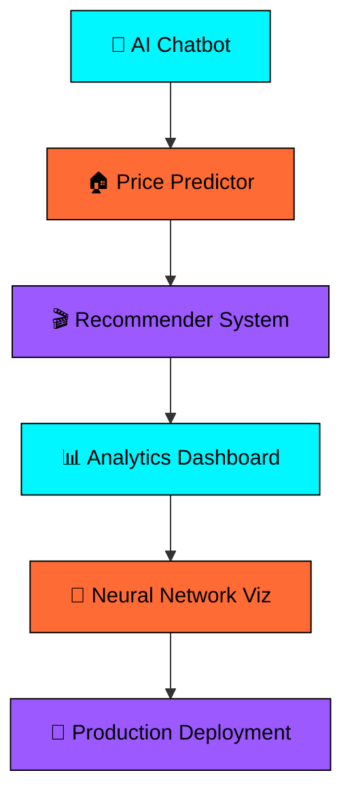

#  **DARSHAN DNYANDEV GADEKAR**

<div align="center">
  
</div>

<div align="center">
  <a href="https://git.io/typing-svg">
    
  </a>
</div>

<!-- Neural Network Activity Display -->
<div align="center">
  <br>
  
  <!-- Custom animated neural network SVG -->
  <svg width="850" height="200" viewBox="0 0 850 200" xmlns="http://www.w3.org/2000/svg" role="img" aria-label="Neural Network Activity">
    <defs>
      <linearGradient id="neuralGrad" x1="0%" y1="0%" x2="100%" y2="0%">
        <stop offset="0%" style="stop-color:#00F7FF;stop-opacity:1">
          <animate attributeName="stop-color" values="#00F7FF;#FF6B35;#9B59FF;#00F7FF" dur="6s" repeatCount="indefinite" />
        </stop>
        <stop offset="50%" style="stop-color:#FF6B35;stop-opacity:1">
          <animate attributeName="stop-color" values="#FF6B35;#9B59FF;#00F7FF;#FF6B35" dur="6s" repeatCount="indefinite" />
        </stop>
        <stop offset="100%" style="stop-color:#9B59FF;stop-opacity:1">
          <animate attributeName="stop-color" values="#9B59FF;#00F7FF;#FF6B35;#9B59FF" dur="6s" repeatCount="indefinite" />
        </stop>
      </linearGradient>
      
      <filter id="neuralGlow">
        <feGaussianBlur stdDeviation="8" result="coloredBlur"/>
        <feMerge>
          <feMergeNode in="coloredBlur"/>
          <feMergeNode in="SourceGraphic"/>
        </feMerge>
      </filter>
      
      <radialGradient id="pulseGrad" cx="50%" cy="50%">
        <stop offset="0%" style="stop-color:#00F7FF;stop-opacity:0.8"/>
        <stop offset="70%" style="stop-color:#FF6B35;stop-opacity:0.4"/>
        <stop offset="100%" style="stop-color:#9B59FF;stop-opacity:0.1"/>
      </radialGradient>
    </defs>

    <!-- Background neural grid -->
    <rect width="850" height="200" fill="url(#pulseGrad)" opacity="0.1"/>
    
    <!-- Main neural nodes with complex animations -->
    <g filter="url(#neuralGlow)">
      <!-- Layer 1 nodes -->
      <circle cx="100" cy="60" r="8" fill="url(#neuralGrad)" opacity="0.9">
        <animate attributeName="r" values="6;14;6" dur="3.2s" repeatCount="indefinite" />
        <animate attributeName="cy" values="60;55;65;60" dur="4s" repeatCount="indefinite" />
      </circle>
      <circle cx="100" cy="140" r="7" fill="url(#neuralGrad)" opacity="0.85">
        <animate attributeName="r" values="5;12;5" dur="2.8s" repeatCount="indefinite" begin="0.5s" />
        <animate attributeName="cy" values="140;145;135;140" dur="4.5s" repeatCount="indefinite" />
      </circle>
      
      <!-- Layer 2 nodes -->
      <circle cx="250" cy="40" r="9" fill="url(#neuralGrad)" opacity="0.95">
        <animate attributeName="r" values="7;15;7" dur="3.6s" repeatCount="indefinite" begin="1s" />
        <animate attributeName="cy" values="40;35;45;40" dur="3.8s" repeatCount="indefinite" />
      </circle>
      <circle cx="250" cy="100" r="8" fill="url(#neuralGrad)" opacity="0.9">
        <animate attributeName="r" values="6;13;6" dur="2.9s" repeatCount="indefinite" begin="0.3s" />
        <animate attributeName="cy" values="100;95;105;100" dur="4.2s" repeatCount="indefinite" />
      </circle>
      <circle cx="250" cy="160" r="7" fill="url(#neuralGrad)" opacity="0.8">
        <animate attributeName="r" values="5;11;5" dur="3.1s" repeatCount="indefinite" begin="0.8s" />
        <animate attributeName="cy" values="160;165;155;160" dur="3.9s" repeatCount="indefinite" />
      </circle>
      
      <!-- Layer 3 nodes -->
      <circle cx="400" cy="50" r="10" fill="url(#neuralGrad)" opacity="0.95">
        <animate attributeName="r" values="8;16;8" dur="3.4s" repeatCount="indefinite" begin="0.2s" />
        <animate attributeName="cy" values="50;45;55;50" dur="4.1s" repeatCount="indefinite" />
      </circle>
      <circle cx="400" cy="100" r="9" fill="url(#neuralGrad)" opacity="0.9">
        <animate attributeName="r" values="7;14;7" dur="2.7s" repeatCount="indefinite" begin="0.7s" />
        <animate attributeName="cy" values="100;105;95;100" dur="3.7s" repeatCount="indefinite" />
      </circle>
      <circle cx="400" cy="150" r="8" fill="url(#neuralGrad)" opacity="0.85">
        <animate attributeName="r" values="6;12;6" dur="3.3s" repeatCount="indefinite" begin="1.2s" />
        <animate attributeName="cy" values="150;145;155;150" dur="4.3s" repeatCount="indefinite" />
      </circle>
      
      <!-- Layer 4 nodes -->
      <circle cx="550" cy="70" r="9" fill="url(#neuralGrad)" opacity="0.9">
        <animate attributeName="r" values="7;15;7" dur="3.0s" repeatCount="indefinite" begin="0.4s" />
        <animate attributeName="cy" values="70;65;75;70" dur="4.0s" repeatCount="indefinite" />
      </circle>
      <circle cx="550" cy="130" r="8" fill="url(#neuralGrad)" opacity="0.85">
        <animate attributeName="r" values="6;13;6" dur="2.6s" repeatCount="indefinite" begin="0.9s" />
        <animate attributeName="cy" values="130;135;125;130" dur="3.6s" repeatCount="indefinite" />
      </circle>
      
      <!-- Output layer -->
      <circle cx="700" cy="100" r="11" fill="url(#neuralGrad)" opacity="1">
        <animate attributeName="r" values="9;17;9" dur="3.5s" repeatCount="indefinite" begin="0.6s" />
        <animate attributeName="cy" values="100;95;105;100" dur="4.4s" repeatCount="indefinite" />
      </circle>
    </g>

    <!-- Neural connections with flowing data -->
    <g stroke="url(#neuralGrad)" strokeWidth="2" fill="none" strokeLinecap="round" opacity="0.8">
      <!-- Layer 1 to Layer 2 connections -->
      <path d="M108 60 Q180 30, 242 40" strokeDasharray="8 4">
        <animate attributeName="stroke-dashoffset" from="0" to="60" dur="4s" repeatCount="indefinite"/>
        <animate attributeName="stroke-width" values="2;4;2" dur="3s" repeatCount="indefinite"/>
      </path>
      <path d="M108 60 Q180 80, 242 100" strokeDasharray="8 4" opacity="0.6">
        <animate attributeName="stroke-dashoffset" from="60" to="0" dur="4.5s" repeatCount="indefinite"/>
        <animate attributeName="stroke-width" values="2;3;2" dur="3.5s" repeatCount="indefinite"/>
      </path>
      <path d="M108 140 Q180 120, 242 100" strokeDasharray="8 4">
        <animate attributeName="stroke-dashoffset" from="0" to="60" dur="3.8s" repeatCount="indefinite"/>
      </path>
      <path d="M108 140 Q180 150, 242 160" strokeDasharray="8 4" opacity="0.7">
        <animate attributeName="stroke-dashoffset" from="60" to="0" dur="4.2s" repeatCount="indefinite"/>
      </path>
      
      <!-- Layer 2 to Layer 3 connections -->
      <path d="M258 40 Q330 45, 392 50" strokeDasharray="8 4">
        <animate attributeName="stroke-dashoffset" from="0" to="60" dur="4.3s" repeatCount="indefinite"/>
      </path>
      <path d="M258 100 Q330 75, 392 50" strokeDasharray="8 4" opacity="0.6">
        <animate attributeName="stroke-dashoffset" from="60" to="0" dur="3.9s" repeatCount="indefinite"/>
      </path>
      <path d="M258 100 Q330 100, 392 100" strokeDasharray="8 4">
        <animate attributeName="stroke-dashoffset" from="0" to="60" dur="4.1s" repeatCount="indefinite"/>
      </path>
      <path d="M258 160 Q330 155, 392 150" strokeDasharray="8 4" opacity="0.8">
        <animate attributeName="stroke-dashoffset" from="60" to="0" dur="3.7s" repeatCount="indefinite"/>
      </path>
      
      <!-- Layer 3 to Layer 4 connections -->
      <path d="M408 50 Q480 60, 542 70" strokeDasharray="8 4">
        <animate attributeName="stroke-dashoffset" from="0" to="60" dur="4.4s" repeatCount="indefinite"/>
      </path>
      <path d="M408 100 Q480 85, 542 70" strokeDasharray="8 4" opacity="0.7">
        <animate attributeName="stroke-dashoffset" from="60" to="0" dur="4.0s" repeatCount="indefinite"/>
      </path>
      <path d="M408 100 Q480 115, 542 130" strokeDasharray="8 4">
        <animate attributeName="stroke-dashoffset" from="0" to="60" dur="3.6s" repeatCount="indefinite"/>
      </path>
      <path d="M408 150 Q480 140, 542 130" strokeDasharray="8 4" opacity="0.9">
        <animate attributeName="stroke-dashoffset" from="60" to="0" dur="4.6s" repeatCount="indefinite"/>
      </path>
      
      <!-- Layer 4 to Output connections -->
      <path d="M558 70 Q630 85, 692 100" strokeDasharray="8 4">
        <animate attributeName="stroke-dashoffset" from="0" to="60" dur="4.2s" repeatCount="indefinite"/>
        <animate attributeName="stroke-width" values="2;5;2" dur="3s" repeatCount="indefinite"/>
      </path>
      <path d="M558 130 Q630 115, 692 100" strokeDasharray="8 4">
        <animate attributeName="stroke-dashoffset" from="60" to="0" dur="3.8s" repeatCount="indefinite"/>
        <animate attributeName="stroke-width" values="2;4;2" dur="3.2s" repeatCount="indefinite"/>
      </path>
    </g>

    <!-- Status indicators -->
    <g fill="white" fontSize="12" fontFamily="monospace">
      <text x="425" y="25" textAnchor="middle" fill="#00F7FF">
        ⟨ NEURAL NETWORK ACTIVITY ⟩
        <animate attributeName="opacity" values="1;0.5;1" dur="2s" repeatCount="indefinite"/>
      </text>
      <text x="425" y="185" textAnchor="middle" fill="#FF6B35" fontSize="10">
        Training: PyTorch • TensorFlow • Real-time Learning • Model Optimization
        <animate attributeName="opacity" values="0.7;1;0.7" dur="3s" repeatCount="indefinite"/>
      </text>
    </g>
  </svg>
  
</div>

<div align="center">
  <br>
  <a href="https://www.linkedin.com/in/darshan-gadekar-b98551269/" target="_blank">
    
  </a>
  <a href="mailto:darshan.gadekar@example.com">
    
  </a>
  <a href="https://github.com/gadekardarshan" target="_blank">
    
  </a>
  <a href="#" target="_blank">
    
  </a>
</div>


## 🚀 About Me


<details open>
<summary><strong>👨‍💻 Neural Profile</strong></summary>

```python
class DarshanGadekar:
    def __init__(self):
        self.name = "Darshan Dnyandev Gadekar"
        self.role = "AI/ML Engineer & Python Developer"
        self.location = "Pune, Maharashtra, India 🇮🇳"
        self.education = {
            "current": "B.E. Information Technology (Pursuing)",
            "institution": "JSPM's JSCOE Hadapsar (SPPU)",
            "foundation": "Diploma in Computer Engineering"
        }
        
        # Core programming arsenal
        self.languages = [
            "Python 🐍", "Java ☕", "C/C++ ⚡", 
            "JavaScript 🟨", "HTML/CSS 🎨", "SQL 🗄️"
        ]
        
        # AI/ML specialization
        self.ai_expertise = {
            "frameworks": ["PyTorch", "TensorFlow", "Scikit-learn", "Keras"],
            "nlp": ["Hugging Face", "OpenAI", "LangChain", "Transformers"],
            "data": ["Pandas", "NumPy", "Matplotlib", "Seaborn"],
            "deployment": ["FastAPI", "Flask", "Streamlit", "Docker"],
            "techniques": ["Fine-tuning", "LoRA/QLoRA", "RAG", "Transfer Learning"]
        }
        
        # Current mission
        self.focus = "Building production-ready AI systems that solve real problems"
        self.passion = "Transforming data into intelligent solutions"
        self.vision = "Making AI accessible and beneficial for everyone"
        
        # Professional experience
        self.experience = {
            "internship": "Android Development - Proasure Technologies (Jan-Mar 2023)",
            "skills_gained": ["Mobile development", "Firebase", "UI/UX optimization"]
        }
    
    def get_current_projects(self):
        return [
            "🤖 Advanced AI Chatbot with RAG implementation",
            "🏠 ML-powered House Price Prediction System", 
            "🎬 Hybrid Movie Recommendation Engine",
            "📊 Real-time Data Analytics Dashboard",
            "🧠 Neural Network Visualization Tools"
        ]
    
    def get_learning_path(self):
        return {
            "2024_goals": [
                "Master Deep Learning architectures",
                "Deploy ML models at scale",
                "Contribute to open-source AI projects",
                "Build end-to-end ML pipelines"
            ],
            "next_skills": [
                "Computer Vision", "MLOps", "Cloud AI Services",
                "Reinforcement Learning", "Edge AI"
            ]
        }
    
    def get_philosophy(self):
        return """
        🎯 Code with Purpose: Every line should solve a real problem
        🚀 Build with Impact: Technology should empower people
        🧠 Learn Continuously: The field evolves, so must we
        🤝 Collaborate Openly: Great solutions come from great teams
        """

# Initialize the AI developer
me = DarshanGadekar()
print(f"🚀 Mission: {me.focus}")
print(f"💡 Vision: {me.vision}")
print(me.get_philosophy())
```

</details>

<br clear="right"/>

## 🛠️ Technology Stack

<details open>
<summary><strong>⚡ My Neural Toolkit</strong></summary>

<div align="center">

### 🧠 AI & Machine Learning Core
<p>
  
  
  
  
</p>

### 🤖 Generative AI & NLP
<p>
  
  
  
  
</p>

### 💻 Programming Languages
<p>
  
</p>

### 📊 Data Science & Analytics
<div align="center">
  
  
  
  
  
</div>

### 🌐 Web Development & APIs
<p align="center">
  
  
  
  
</p>

### 🗄️ Databases & Cloud
<p align="center">
  
  
  
</p>

### 🛠️ Development & DevOps
<p align="center">
  
  
  
</p>

</div>

</details>


## 📈 GitHub Performance Dashboard

<div align="center">

### 🔥 Contribution Metrics


### 📊 Repository Statistics  
<div>
  
  
</div>

### 📈 Neural Activity Graph


### 🏆 Achievement Collection


</div>


## 🎯 Mission Control Center

<div align="center">
  <table>
    <tr>
      <td align="center" width="50%">
        <h3>🔭 Current Neural Projects</h3>
        <p>
          🤖 <strong>Advanced AI Chatbot</strong> - RAG implementation<br>
          🏠 <strong>ML Price Predictor</strong> - Real estate analytics<br>
          🎬 <strong>Smart Recommender</strong> - Hybrid filtering system<br>
          📊 <strong>Data Visualizer</strong> - Interactive dashboards<br>
          🧠 <strong>Neural Networks</strong> - Custom architectures
        </p>
      </td>
      <td align="center" width="50%">
        <h3>🌱 Learning & Development</h3>
        <p>
          🔬 <strong>Deep Learning</strong> - Advanced architectures<br>
          ☁️ <strong>MLOps</strong> - Production deployment strategies<br>
          👁️ <strong>Computer Vision</strong> - Image processing & analysis<br>
          🎯 <strong>Reinforcement Learning</strong> - Intelligent agents<br>
          🌐 <strong>Edge AI</strong> - Optimized model deployment
        </p>
      </td>
    </tr>
    <tr>
      <td align="center" width="50%">
        <h3>💬 Expert Knowledge Areas</h3>
        <p>
          🐍 <strong>Python Development</strong> - Best practices & optimization<br>
          🤖 <strong>Machine Learning</strong> - End-to-end model building<br>
          🧠 <strong>Neural Networks</strong> - Custom architecture design<br>
          📊 <strong>Data Science</strong> - Statistical analysis & insights<br>
          🚀 <strong>AI Deployment</strong> - Production-ready systems
        </p>
      </td>
      <td align="center" width="50%">
        <h3>⚡ Quantum Facts</h3>
        <p>
          I believe <strong>AI should amplify human creativity</strong><br>
          rather than replace it! 🤖🤝👨‍💻<br><br>
          <strong>Debugging neural networks is like</strong><br>
          <strong>teaching a child to think! 🧠✨</strong><br><br>
          <em>Coffee powers my training loops ☕⚡</em>
        </p>
      </td>
    </tr>
  </table>
</div>

## 🎨 Featured Project Showcase

<div align="center">

### 🚀 Repository Highlights

[](https://github.com/gadekardarshan/taskmanager)
[](https://github.com/gadekardarshan/github.com-darshangadekar-CodeSoftInternship-Java-Programming)

<br>

### 💡 Project Roadmap


</div>

## 🎮 Beyond The Code Matrix

<div align="center">

### 🌟 When Neural Networks Rest

```python
def my_offline_activities():
    interests = {
        "🎵 Audio Processing": "Lo-fi beats fuel my coding sessions",
        "📚 Knowledge Absorption": "AI research papers & tech innovations", 
        "🏃‍♂️ Physical Optimization": "Cricket enthusiast & fitness geek",
        "🎮 Strategic Thinking": "Chess, puzzle games & problem solving",
        "📸 Visual Data Collection": "Photography & moment capturing",
        "🌱 Continuous Learning": "Always exploring emerging technologies",
        "🍕 Energy Refueling": "Pizza + Code = Perfect debugging combo"
    }
    
    philosophy = """
    🎯 Work-Life Balance Algorithm:
    while True:
        code_intensively()
        learn_something_new()
        connect_with_people()
        recharge_creativity()
        repeat_with_passion()
    """
    
    return interests, philosophy

interests, philosophy = my_offline_activities()
print("🌟 Life is a beautiful algorithm of experiences!")
```

</div>

## 🌐 Professional Network Hub

<div align="center">
  
  <h3>🤝 Let's Build The Future Together!</h3>
  
  <p>
    <em>"The best way to predict the future is to create it with AI"</em> - Darshan's Version
  </p>
  
  [](https://your-portfolio-url.com)
  [](https://www.linkedin.com/in/darshan-gadekar-b98551269/)
  [](mailto:darshan.gadekar@example.com)
  [](https://your-resume-link.com)
  
  <br><br>
  
  <h3>📊 Neural Network Analytics</h3>
  
  
  
  
  
  
  <br><br>
  
  <h3>💎 Support The Neural Journey</h3>
  
  <p>If my work resonates with your neural pathways:</p>
  
  ⭐ **Star** repositories that inspire you<br>
  🔄 **Share** projects with your network<br>
  💬 **Engage** in meaningful tech discussions<br>
  🤝 **Collaborate** on groundbreaking AI projects<br>
  📢 **Recommend** me for exciting opportunities
  
  <br>
  
  ### 🎯 Open For Opportunities
  
  <div align="center">
    <table>
      <tr>
        <td align="center" width="33%">
          <h4>🚀 Internships</h4>
          <p>AI/ML Engineering<br>Python Development<br>Data Science Roles</p>
        </td>
        <td align="center" width="33%">
          <h4>🤝 Collaborations</h4>
          <p>Open Source Projects<br>Research Initiatives<br>Startup Ventures</p>
        </td>
        <td align="center" width="33%">
          <h4>📚 Mentorship</h4>
          <p>Learning Together<br>Knowledge Sharing<br>Community Building</p>
        </td>
      </tr>
    </table>
  </div>
  
</div>

## 🌟 Testimonials & Recognition

<div align="center">

> *"Darshan demonstrates exceptional problem-solving skills and a deep understanding of modern AI technologies. His passion for learning and implementing cutting-edge solutions is truly impressive."*  
> **— Industry Professional**

> *"A dedicated student with remarkable potential in AI/ML development. His projects show both technical depth and practical application."*  
> **— Academic Mentor**

</div>

---

<div align="center">
  
  
  <h2>🎉 Thanks for visiting my neural network!</h2>
  
  <p>
    <em>"In a world full of algorithms, be the one that solves meaningful problems"</em><br>
    <strong>- Darshan's AI Philosophy</strong>
  </p>
  
  
  
  <div align="center">
    
    ### 🧠 Daily Neural Activation Sequence
    
    ```bash
    $ ./start_day.sh
    > Initializing neural pathways...
    > Loading AI knowledge base...
    > Activating curiosity protocols...
    > Setting creativity to maximum...
    > Ready to code the future! 🚀
    
    $ whoami
    > Darshan Gadekar: AI Engineer | Problem Solver | Future Builder
    
    $ cat current_mission.txt  
    > Building intelligent systems that make a difference
    > One neural network at a time...
    
    $ echo "Let's connect and create something amazing! ✨"
    ```
    
  </div>
  
  <br>
  
  ### 🌌 "The future belongs to those who can teach machines to learn"
  
  <p>
    <strong>Keep coding, keep learning, keep innovating! 💻🧠⚡</strong>
  </p>
  
  <br>
  
  <!-- Custom animated footer message -->
  <div style="display: flex; align-items: center; justify-content: center; gap: 10px;">
    <span>🤖</span>
    <span><strong>Powered by Neural Networks</strong></span>
    <span>•</span>
    <span><strong>Fueled by Curiosity</strong></span>
    <span>•</span>
    <span><strong>Driven by Impact</strong></span>
    <span>🚀</span>
  </div>
  
</div>

<!-- Snake Animation (requires GitHub Action) -->
<div align="center">
  
</div>

---

<div align="center">
  <sub>✨ <strong>Handcrafted with ❤️ and lots of ☕ by Darshan Gadekar</strong> ✨</sub><br>
  <sub>🤖 <strong>This README is powered by AI creativity and human passion</strong> 🤖</sub><br>
  <sub>🌟 <strong>Last updated: $(date +'%B %Y') - Always evolving!</strong> 🌟</sub>
</div>

<!-- Hidden easter egg for developers who read the source -->
<!-- 
🎉 CONGRATULATIONS! 🎉
You found the hidden easter egg! 
If you're reading this in the source code, you're definitely a fellow developer.
Feel free to reach out - let's build something incredible together! 
🚀 Neural networks unite! 🤖
-->
