# 🚀 Darshan Dnyandev Gadekar

<div align="center">

<!-- Animated Header -->


<!-- Typing Animation -->


<br/>

<!-- Social Badges -->
[](https://www.linkedin.com/in/darshan-gadekar-b98551269/)
[](mailto:gadekardarshan@gmail.com)
[](https://github.com/gadekardarshan)
[](https://gadekardarshan.github.io/)
[](https://drive.google.com/file/d/1HfPDTMYt2HkTZBtbup-tKyRaVYqX1EZA/view?usp=sharing)

</div>

---

## 🧠 About Me


- 🎓 **B.E. Information Technology** student at JSPM's JSCOE Hadapsar (SPPU)
- 🤖 Passionate **AI/ML Engineer** specializing in deep learning and NLP
- 🐍 **Python Developer** with expertise in building scalable applications
- 🌱 Currently exploring **Computer Vision** and **MLOps**
- 💡 Love turning complex data into actionable insights
- ☕ Powered by coffee and curiosity!

### 🎯 Current Focus
```python
class DarshanGadekar:
    def __init__(self):
        self.current_work = ["AI Chatbot Development", "ML Model Deployment"]
        self.learning = ["Computer Vision", "MLOps", "Cloud AI Services"]
        self.interests = ["Deep Learning", "NLP", "Data Science"]
        self.goals = ["Contribute to Open Source", "Build AI Products"]
    
    def get_daily_routine(self):
        return ["☕ Coffee", "💻 Code", "📚 Learn", "🔄 Repeat"]
```

---

## 🛠️ Tech Arsenal

<div align="center">

### 🤖 AI & Machine Learning


### 🌐 Web & API Development


### 🗄️ Databases & Tools


</div>

---

## 📊 GitHub Analytics

<div align="center">

<!-- GitHub Stats -->


<br/>

<!-- GitHub Streak -->


<br/>

<!-- Activity Graph -->


<!-- Trophies -->


</div>

---

## 🚀 Featured Projects

<div align="center">

<table>
<tr>
<td width="50%">
<h3 align="center">🤖 AI Chatbot with RAG</h3>
<div align="center">  
<a href="https://github.com/gadekardarshan/ai-chatbot" target="_blank">

</a>
<br>
<br>
<p>
<a href="https://github.com/gadekardarshan/ai-chatbot" target="_blank">

</a>
</p>
</div>
</td>

<td width="50%">
<h3 align="center">🏠 House Price Predictor</h3>
<div align="center">
<a href="https://github.com/gadekardarshan/house-price-prediction" target="_blank">

</a>
<br>
<br>
<p>
<a href="https://github.com/gadekardarshan/house-price-prediction" target="_blank">

</a>
</p>
</div>
</td>
</tr>

<tr>
<td width="50%">
<h3 align="center">🎬 Movie Recommender</h3>
<div align="center">
<a href="https://github.com/gadekardarshan/movie-recommender" target="_blank">

</a>
<br>
<br>
<p>
<a href="https://github.com/gadekardarshan/movie-recommender" target="_blank">

</a>
</p>
</div>
</td>

<td width="50%">
<h3 align="center">📋 Task Manager App</h3>
<div align="center">
<a href="https://github.com/gadekardarshan/task-manager" target="_blank">

</a>
<br>
<br>
<p>
<a href="https://github.com/gadekardarshan/task-manager" target="_blank">

</a>
</p>
</div>
</td>
</tr>
</table>

</div>

---

## 📈 Coding Activity

<div align="center">

<!-- WakaTime Stats -->


<!-- Profile Views -->


</div>

---

## 🎯 Current Goals & Learning Path

```mermaid
graph TD
    A[🎯 Current Goals] --> B[🤖 Master Deep Learning]
    A --> C[☁️ Learn MLOps]
    A --> D[🏗️ Build AI Products]
    
    B --> E[🧠 Neural Networks]
    B --> F[👁️ Computer Vision]
    
    C --> G[🐳 Docker & K8s]
    C --> H[⚡ Model Deployment]
    
    D --> I[🌐 Web Applications]
    D --> J[📱 Mobile AI Apps]
    
    style A fill:#ff6b6b
    style B fill:#4ecdc4
    style C fill:#45b7d1
    style D fill:#96ceb4
```

<div align="center">



</div>

---

## 🌟 Fun Facts & Interests

<div align="center">

<table>
<tr>
<td width="50%" align="center">
<h3>⚡ Quick Facts</h3>
<ul align="left">
<li>🌍 Based in Pune, Maharashtra, India</li>
<li>🎓 Information Technology Student</li>
<li>🤖 AI/ML Enthusiast since 2022</li>
<li>☕ Coffee addiction level: Expert</li>
<li>🧩 Love solving complex problems</li>
<li>🎯 Always up for new challenges</li>
</ul>
</td>

<td width="50%" align="center">
<h3>🎨 When Not Coding</h3>
<ul align="left">
<li>🏏 Playing Cricket</li>
<li>📚 Reading AI Research Papers</li>
<li>🎮 Strategic Gaming</li>
<li>📸 Photography</li>
<li>🎵 Listening to Lo-fi Music</li>
<li>🧠 Learning New Technologies</li>
</ul>
</td>
</tr>
</table>

</div>

---

## 💬 Let's Connect & Collaborate!

<div align="center">

<h3>🚀 Open to Opportunities</h3>

- 💼 **Internships** in AI/ML Engineering
- 🤝 **Open Source** collaborations  
- 🔬 **Research** projects in AI/ML
- 📚 **Knowledge sharing** and mentorship
- 💡 **Innovative projects** that make a difference

<br/>

<h3>📫 Reach Out</h3>

<p>
<a href="https://www.linkedin.com/in/darshan-gadekar-b98551269/" target="_blank">

</a>
<a href="mailto:gadekardarshan@gmail.com">

</a>
<a href="https://github.com/gadekardarshan" target="_blank">

</a>
<a href="https://gadekardarshan.github.io/" target="_blank">

</a>
</p>

<br/>

<!-- Quote -->
<h3>💭 Philosophy</h3>
<blockquote>
<em>"The best way to predict the future is to create it with AI"</em>
</blockquote>

</div>

---

## 🎉 Thanks for Visiting!

<div align="center">

<!-- Animated Footer -->


<!-- Fun Animated Elements -->
<div>
 
<strong>Keep Learning, Keep Growing!</strong>

</div>

<br/>

<!-- Contribution Snake -->
<picture>
  <source media="(prefers-color-scheme: dark)" srcset="https://raw.githubusercontent.com/gadekardarshan/gadekardarshan/output/github-contribution-grid-snake-dark.svg">
  <source media="(prefers-color-scheme: light)" srcset="https://raw.githubusercontent.com/gadekardarshan/gadekardarshan/output/github-contribution-grid-snake.svg">
  
</picture>

<br/>

<!-- Footer Note -->
<sub>✨ Made with ❤️ by Darshan Gadekar | Powered by AI & Coffee ☕</sub>

</div>
